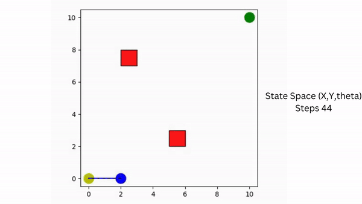

# Tension-Aware Path Planning for Tethered Robots on Extreme Terrain Using Reinforcement Learning

# Introduction
In the domain of planetary exploration, navigating extreme terrains presents a formidable challenge for robotic systems. Tethered robots, exemplified by Axel, offer a promising solution for traversing steep slopes on planetary missions by leveraging the tension provided by their tethers. Typically operating in pairs, with one robot navigating a flat surface while the other tackles steep slopes, these robots rely on optimal tether tension for successful exploration. However, maintaining optimal tension, especially when traction on the top robot's wheels is insufficient, can be complex. In such scenarios, winding the tether around objects in the environment induces the capstan effect, enhancing friction and augmenting tether tension, thereby enabling navigation on steep slopes.

This project addresses the challenge of tension-aware, winding-constrained path planning for tethered robots. The objective is to find a collision-free path from the start state to the goal state while achieving a user-defined winding angle to induce the required tether tension due to the capstan effect. Leveraging reinforcement learning techniques such as Monte Carlo control, SARSA, Q-learning, and Deep Q-learning, the proposed approach learns an optimal policy for path planning. This policy considers winding constraints and optimizes the overall path, enhancing adaptability to complex environments. By training the agent to navigate while managing tether tension, this project aims to develop a robust solution for tethered robots operating in extreme terrain conditions.

Tether winding path visulization

  

# Repository Contents

Code: Contains the implementation of the reinforcement learning-based approach for tension-aware, winding-constrained path planning for tethered robots. 
Video: Includes video of testing the path planning algorithm. 
Plots: Stores plots used in the project documentation or presentation. 
Report: Includes the presentation and project report. 
README.md: Provides an overview of the project, installation instructions, usage guidelines, and other relevant information.  

# Usage

To use the codebase for tension-aware, winding-constrained path planning: 
-Clone the repository to your local machine. 
-Install the necessary dependencies as specified in the requirements file. 
-Run the main script or Jupyter notebooks to execute the path planning algorithm. 
-Customize parameters or configurations as needed for specific scenarios. 
-Analyze the results and adapt the approach as required for your application. 
